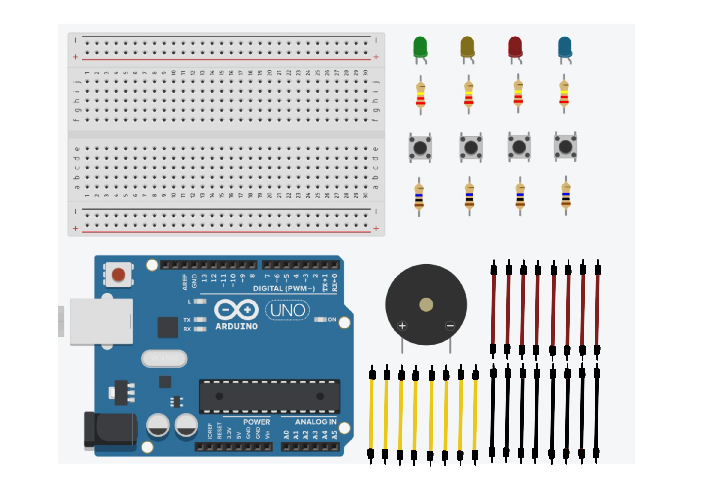
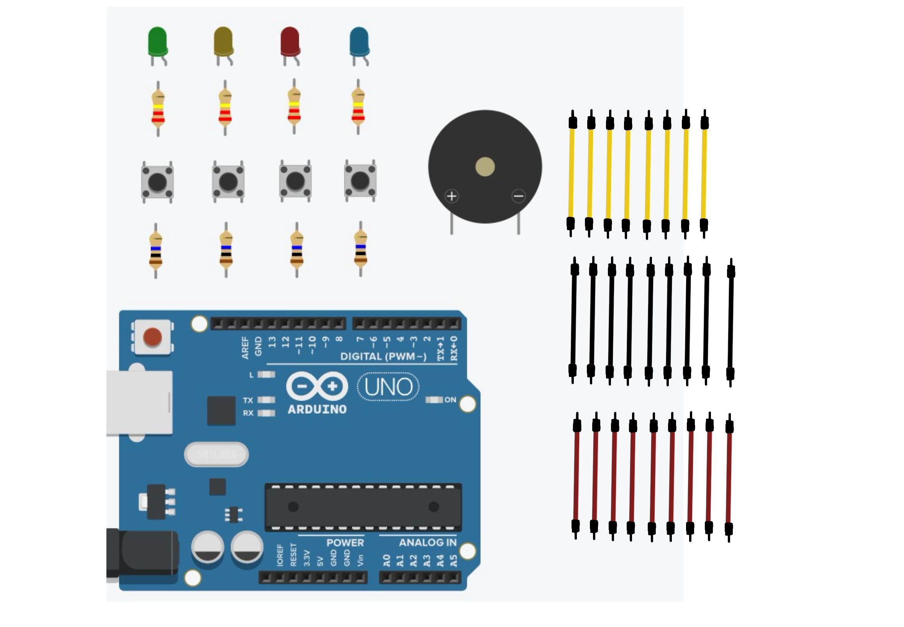
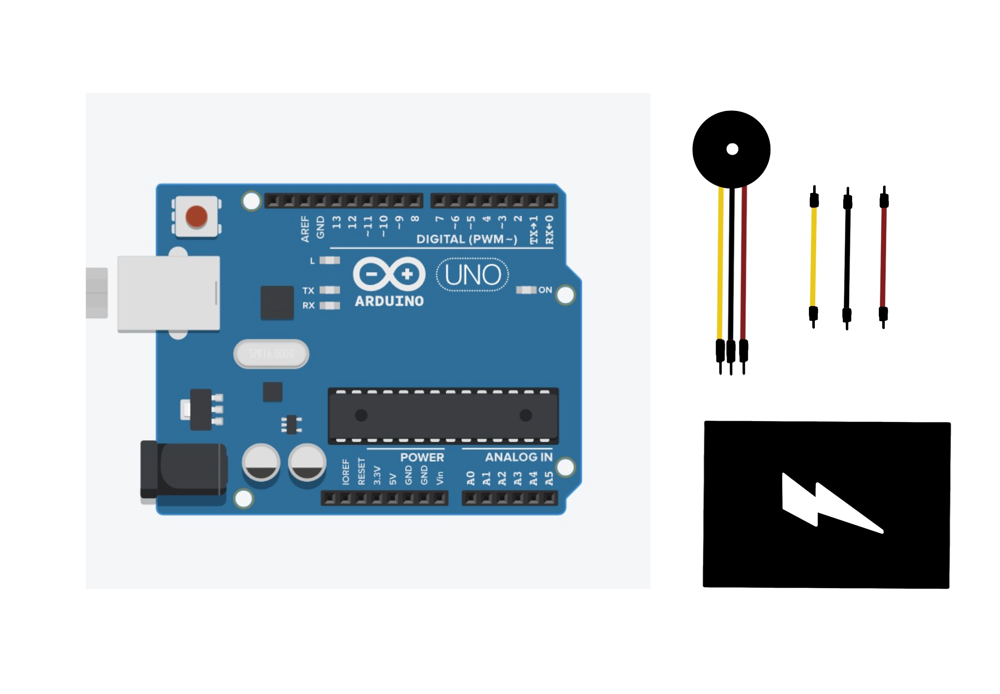

# Examen

## Fechas importantes

- Fecha de entrega: 26/06

## Solemne 01 - descripción del artefacto

Juego de memoria interactivo en el que el jugador deberá memorizar una secuencia de luces LEDs y sonidos, y reproducirlos mediante pulsadores.

## Solemne 01 - tecnologías y Herramientas de trabajo

- Arduino UNO R4.
- Arduino IDE.
- Cables Dupont.
- LEDs rojo, azul, amarillo y verde.
- Botones pulsadores.
- Breadboard.
- Resistencias de 220 ohms.
- Resistencias de 10k ohms.
- Buzzer.



## Solemne 01 - tecnologías y Herramientas de trabajo **actualizadas**

- Arduino UNO R4.
- Arduino IDE.
- Cables Dupont.
- LEDs rojo, azul, amarillo y verde.
- Botones pulsadores.
- Resistencias de 220 ohms.
- Resistencias de 10k ohms.
- Buzzer.
- Cautín.
- Soldadura de estaño.



## Solemne 01 - mejoras aplicadas

A nivel software:

- Botón encendido/apagado:

```cpp
// según el estado del botón, imprime en la consola encendido o apagado
  estadoBoton = digitalRead(pinBoton);
  if (estadoBoton != ultimoEstadoBoton) {
    if (estadoBoton == HIGH) {
      juegoEncendido = !juegoEncendido;
      if (juegoEncendido) {
        Serial.println("Juego de memoria encendido.");
        iniciarJuego();
      } else {
        Serial.println("Juego de memoria apagado.");
        apagarJuego();
      }
    }
    ultimoEstadoBoton = estadoBoton;
  }

  if (juegoEncendido && !perder) {
    jugarRonda();
  }
```

- Función para iniciar el juego:

``` cpp
 void iniciarJuego() {
  ronda = 0;
  paso = 0;
  perder = false;
  secuencia[ronda] = random(0, 3);
  ronda++;
 }
```

- Función para apagar el juego:

```cpp
void apagarJuego() {
  // apaga los LEDs y el buzzer
  noTone(buzzer);
  for (int i = 0; i < 3; i++) {
    digitalWrite(leds[i], LOW);
  }
  // reinicia el juego
  ronda = 0;
  perder = false;
}
```

## Solemne 02 - descripción del artefacto

Collar interactivo de pulso utilizando Arduino. El proyecto consiste en un sistema de comunicación basado en WiFi entre dos microcontroladores Arduino, un servidor y un cliente, y Processing. Arduino actúa como un dispositivo de adquisición de datos del sensor, mientras que la aplicación Processing sirve como una herramienta de visualización de datos.

## Solemne 02 - tecnologías y Herramientas de trabajo

- 2x Arduino UNO R4 wifi.
- Cables.
- Alambre.
- Pilas.
- Sensor de pulso cardiaco.



## Solemne 02 - tecnologías y Herramientas de trabajo **actualizado**

- Arduino UNO R4 wifi.
- Cables.
- Corset.
- Batería.
- Sensor de pulso cardiaco.


## Mejoras aplicadas solemne 02

A nivel software:

- Desarrollo e investigación de un código servidor de Arduino con una animación JavaScript que sea capaz de correr en una página web local mediante el protocolo comucacional HTTP.

```cpp
// enviar el cuerpo de la respuesta HTTP
    client.println("<!DOCTYPE HTML>");
    client.println("<html>");
    client.println("<head>");
    client.println("<link rel=\"icon\" href=\"data:,\">");
    client.println("<script src=\"https://cdnjs.cloudflare.com/ajax/libs/p5.js/1.4.0/p5.js\"></script>");
    client.println("<script>");
    client.println("let tiempo = 0;");
    client.println("let colorPrincipal1;");
    client.println("let colorPrincipal2;");
    client.println("let numeroElipses = 70;");
    client.println("function setup() {");
    client.println("  createCanvas(windowWidth, windowHeight);");
    client.println("  colorPrincipal1 = color(255, 0, 0);");
    client.println("  colorPrincipal2 = color(100, 0, 255);");
    client.println("  noStroke();");
    client.println("}");
    client.println("function draw() {");
    client.println("  background(0);");
    client.println("  tiempo += 0.05;");
    client.println("  let anchoVentana = width;");
    client.println("  let altoVentana = height;");
    client.println("  let pulso = sin(tiempo) * min(anchoVentana, altoVentana) / 1.5;");
    client.println("  for (let i = 0; i < numeroElipses; i++) {");
    client.println("    let desplazamiento = sin(tiempo + i * 0.1) * pulso;");
    client.println("    let cambioColor = abs(sin(tiempo + i * 0.2));");
    client.println("    let centroX = map(i, 0, numeroElipses - 1, anchoVentana / 2, 4 * anchoVentana / 2);");
    client.println("    let centroY = altoVentana / 2 - i * 30;");
    client.println("    fill(lerpColor(colorPrincipal1, colorPrincipal2, cambioColor));");
    client.println("    ellipse(centroX, centroY, pulso + desplazamiento, pulso + desplazamiento);");
    client.println("  }");
    client.println("}");
    client.println("</script>");
    client.println("</head>");
    client.println("<body>");
    client.println("</body>");
    client.println("</html>");
    client.flush();
```

Vista previa del código en la web:


## Bibliografía

<https://docs.arduino.cc/tutorials/uno-r4-wifi/wifi-examples/#wi-fi-web-server>
